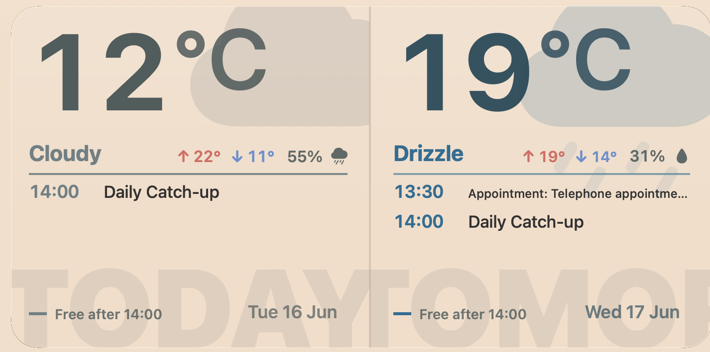
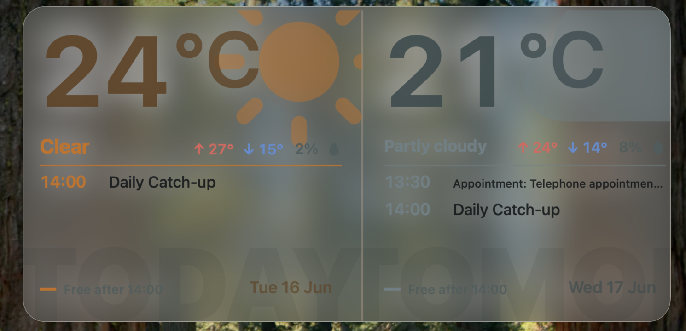
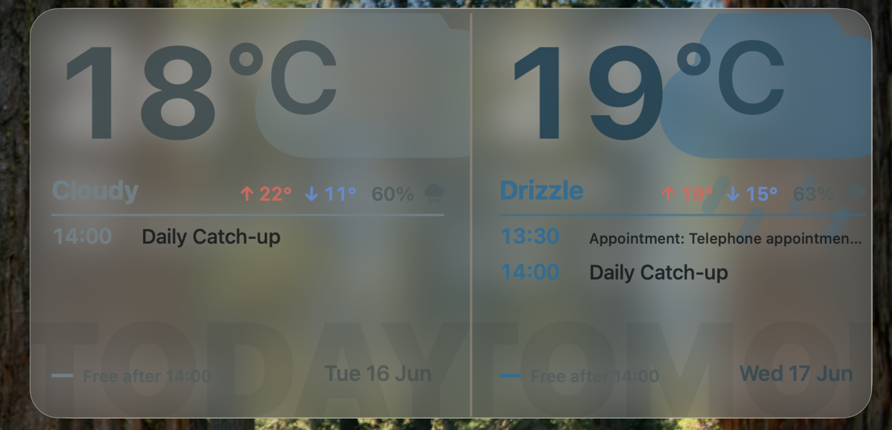
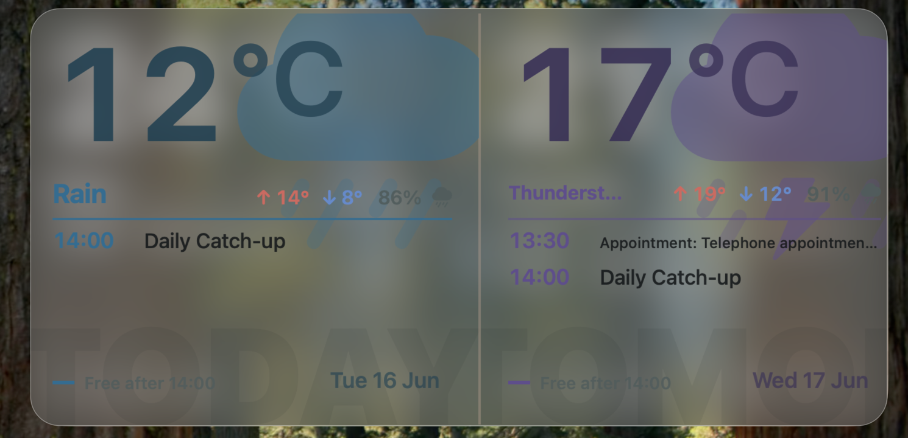
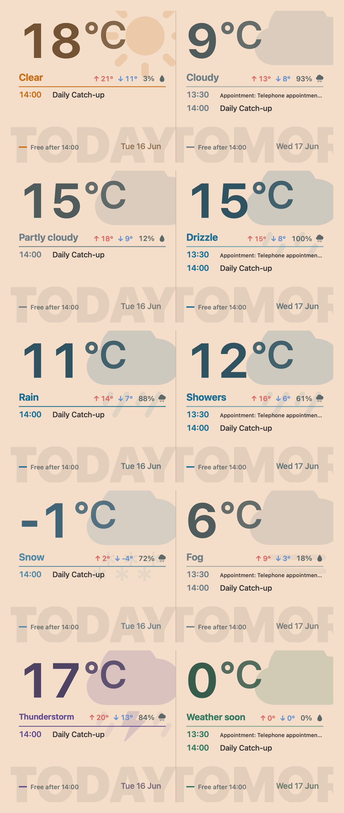
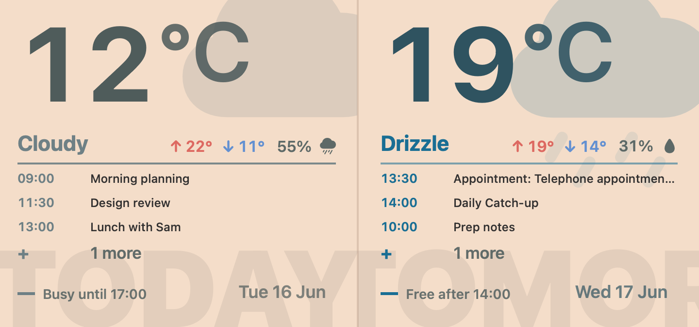

# Daycast

A macOS WidgetKit calendar and weather widget that turns the next two days into a compact desktop poster.

Daycast syncs Calendar events and local weather into a shared app-group snapshot, then renders an extra-large widget with the current temperature, high/low markers, precipitation, free/busy context, and the next useful agenda items for today and tomorrow. It also adapts to your wallpaper: solid macOS colours are matched directly, while photo, aerial, and dynamic wallpapers use native Apple Glass.



## Highlights

- Extra-large macOS widget for today and tomorrow.
- Calendar sync using EventKit full calendar access.
- Local weather from Open-Meteo using Core Location.
- Login item helper so the app can quietly restart after login and keep the widget fresh.
- Shared app-group JSON snapshot for reliable host-app to widget handoff.
- Poster-style weather states with SF Symbol weather art, accent colors, and high/low temperature arrows.
- Wallpaper-aware widget backgrounds with solid-colour matching or native Apple Glass.
- Split appearance handling so desktop widgets can use glass without forcing monochrome desktop icons.
- Colour-preserved weather symbols and temperature accents in glass mode.

## Apple Glass

For photo, aerial, and dynamic wallpapers, Daycast switches desktop widgets into Apple Glass while keeping the forecast art and temperature accents readable.

| Sunny | Cloudy | Rain |
| --- | --- | --- |
|  |  |  |

## Weather States

The widget adapts its colour accents, symbols, precipitation indicator, and temperature treatment across common forecast states.



## Busy Day Example



## Requirements

- macOS 14 or later.
- Xcode 16 or later.
- A signing team with App Groups enabled.

## Build

Open `Daycast.xcodeproj` in Xcode and select the `Daycast` scheme, or build from the command line:

```sh
xcodebuild -project Daycast.xcodeproj -scheme Daycast -configuration Debug build
```

The app contains three targets:

- `Daycast`: the menu-less host app that manages permissions, sync, login item status, and widget reloads.
- `DaycastWidget`: the WidgetKit extension.
- `DaycastLoginHelper`: a login item helper that relaunches the host app after sign-in.

## Configuration Notes

This checkout uses the original development identifiers:

- Main app bundle id: `com.example.daycast`
- Widget bundle id: `com.example.daycast.widget`
- Login helper bundle id: `com.example.daycast.loginhelper`
- App group: `H9GD4A7SQF.com.example.daycast.shared`

If you build this under a different Apple Developer Team, update the team id, bundle ids, app-group entitlement, and `DaycastStore.suiteName` together. The host app and widget must point at the same app group or the widget will render the fallback "open Daycast" state.

## How Sync Works

Daycast writes a `DaycastSnapshot.json` file into the shared app-group container. The host app refreshes that file after calendar or weather updates, then asks WidgetKit to reload the timeline. The widget reads only that shared snapshot, which keeps rendering fast and avoids doing network or calendar work inside the extension.

On macOS, background refresh is handled by a running host app plus the login helper. `BGTaskScheduler` is present only for platforms that support it; the macOS path relies on a timer, calendar-change notifications, and the login item.

## Screenshot Rendering

The local renderer in `Tools/RenderDaycastWidget.swift` can generate README-style screenshots from the SwiftUI widget source:

```sh
xcrun swiftc -D DEBUG -D RENDERER -target arm64-apple-macos14.0 \
  -framework SwiftUI -framework AppKit -framework WidgetKit \
  Tools/RenderDaycastWidget.swift \
  DaycastWidget/DaycastWidget.swift \
  Shared/DaycastModels.swift Shared/DaycastStore.swift Shared/DaycastConstants.swift \
  -o /tmp/render-daycast-widget

/tmp/render-daycast-widget
/tmp/render-daycast-widget --busy
/tmp/render-daycast-widget --weather-matrix
```

The renderer reads the same shared snapshot as the widget, then applies preview weather states for the matrix image.
